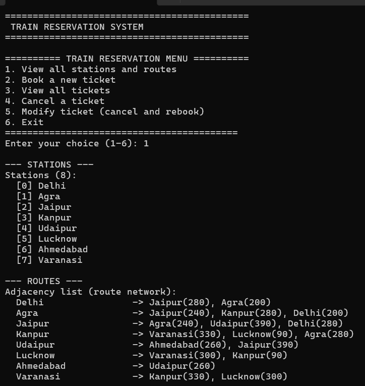
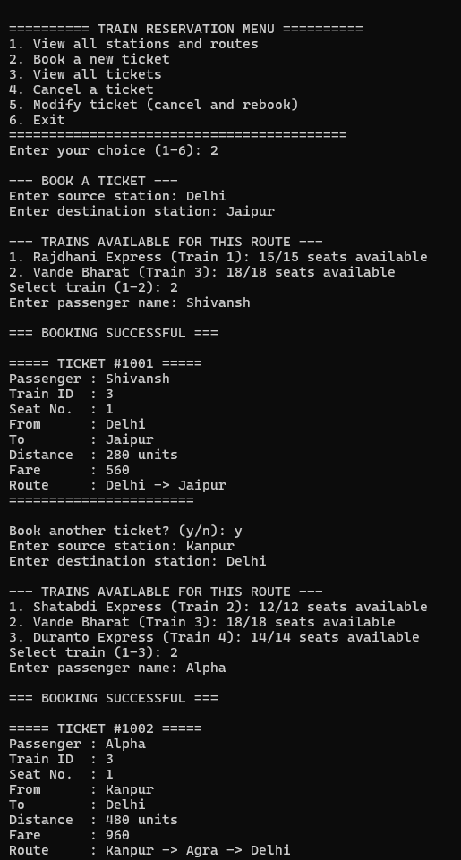
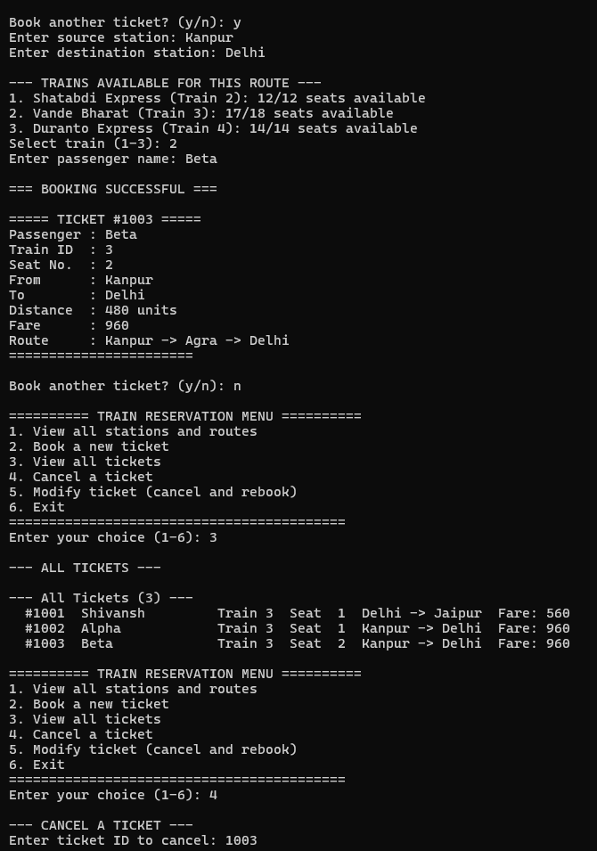
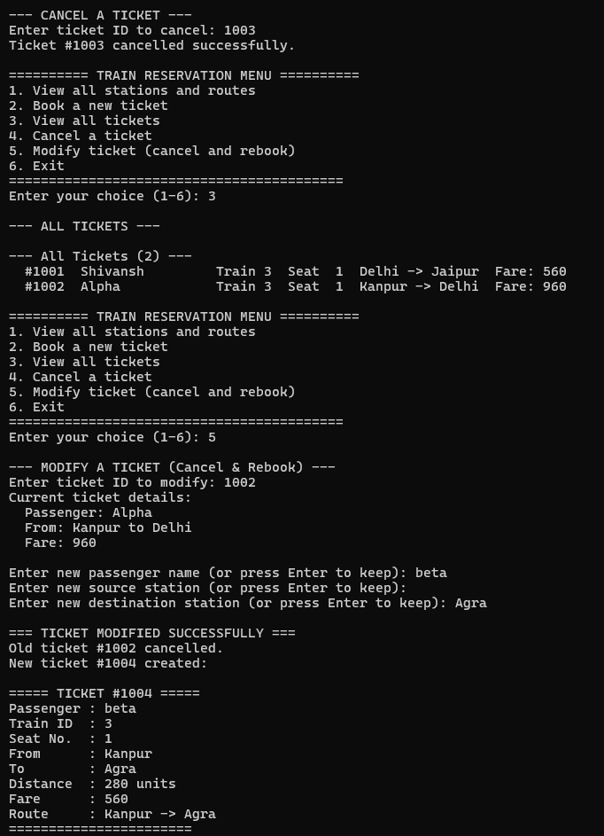
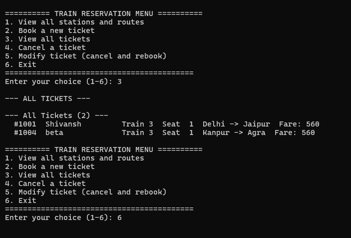

# 🚆 Train Reservation System

A fully interactive **C-based Train Reservation System** built around a **weighted graph** data structure. The system models a real-world railway network using an **adjacency list**, finds the **shortest route** between any two stations using **Dijkstra's algorithm**, and supports complete ticket lifecycle management — booking, viewing, cancellation, and modification.

---

## 📑 Table of Contents

- [Highlights](#-highlights)
- [Screenshots](#-screenshots)
- [Project Structure](#-project-structure)
- [Data Structures & Algorithms Used](#-data-structures--algorithms-used)
- [Features & Functionalities](#-features--functionalities)
- [Stations in the Network](#-stations-in-the-network)
- [Trains Available](#-trains-available)
- [Requirements](#-requirements)
- [How to Run](#-how-to-run)
- [How to Fork & Contribute](#-how-to-fork--contribute)
- [Design Notes](#-design-notes)
- [Future Improvements](#-future-improvements)
- [License](#-license)
- [Author](#-author)

---

## ✨ Highlights

- 🗺️ **Graph-based Station Network** — 8 stations modeled as a weighted graph with an adjacency list.
- 🔍 **Dijkstra's Shortest Path** — Finds the optimal route between any two stations with full route reconstruction.
- 🎫 **Ticket Booking** — Book tickets with automatic seat allocation, unique ticket IDs, and fare calculation.
- 📋 **View All Tickets** — List all active bookings with complete details (passenger, train, route, fare).
- ❌ **Ticket Cancellation** — Cancel any ticket by ID and free up the reserved seat.
- ✏️ **Ticket Modification** — Change passenger name, source, or destination (cancels old ticket and creates a new one).
- 💰 **Dynamic Fare Calculation** — Fare = shortest path distance × 2 (rate per unit distance).
- 🚂 **Multiple Trains** — 4 different trains (Rajdhani Express, Shatabdi Express, Vande Bharat, Duranto Express) with different routes and seat capacities.
- 📊 **Real-time Seat Availability** — Shows available seats per train per route in real-time.
- 🔄 **Interactive Menu-Driven Interface** — Simple and intuitive CLI menu for all operations.

---

## 📸 Screenshots

### 1. Main Menu & View All Stations and Routes (Option 1)



When the program starts, it displays the **Train Reservation System** banner followed by the **interactive menu** with 6 options. Here the user selects **Option 1 — View all stations and routes**, which displays:

- **All 8 stations** in the network (Delhi, Agra, Jaipur, Kanpur, Udaipur, Lucknow, Ahmedabad, Varanasi) with their index numbers.
- **The complete adjacency list** showing every route connection and its distance (weight). For example, Delhi connects to Jaipur (280 km) and Agra (200 km). This is the underlying graph structure that powers the shortest-path routing.

---

### 2. Booking Tickets (Option 2)



The user selects **Option 2 — Book a new ticket**. The booking flow works as follows:

1. **Enter source and destination stations** — The user enters `Delhi` as source and `Jaipur` as destination.
2. **Available trains are displayed** — The system shows all trains that service this route with their real-time seat availability (e.g., Rajdhani Express: 15/15 seats, Vande Bharat: 18/18 seats).
3. **Select a train and enter passenger name** — User selects Train 2 (Vande Bharat) and enters `Shivansh`.
4. **Booking confirmation** — A unique ticket `#1001` is generated with full details: passenger name, train ID, seat number, source, destination, distance (280 units), fare (₹560), and the computed shortest route (`Delhi -> Jaipur`).
5. **Book another ticket** — The system asks if the user wants to book more. Here the user books a second ticket `#1002` for passenger `Alpha` from `Kanpur` to `Delhi`. The system finds the shortest route `Kanpur -> Agra -> Delhi` (480 units, fare ₹960).

---

### 3. View All Tickets & Begin Cancellation (Option 3 & 4)



This screenshot demonstrates two operations in sequence:

1. **Booking another ticket** — A third ticket `#1003` is booked for `Beta` from `Kanpur` to `Delhi` (Seat 2 on Train 3). Notice the seat number increments automatically.
2. **View all tickets (Option 3)** — Lists all 3 active tickets in a clean tabular format:
   - `#1001` — Shivansh, Train 3, Seat 1, Delhi → Jaipur, Fare: 560
   - `#1002` — Alpha, Train 3, Seat 1, Kanpur → Delhi, Fare: 960
   - `#1003` — Beta, Train 3, Seat 2, Kanpur → Delhi, Fare: 960
3. **Cancel a ticket (Option 4)** — The user cancels ticket `#1003`. The system confirms the cancellation and frees up the seat.

---

### 4. Cancel Ticket Confirmation, View Remaining & Modify Ticket (Option 4, 3, 5)



This screenshot shows the full cancel → verify → modify workflow:

1. **Cancellation result** — Ticket `#1003` is confirmed as cancelled.
2. **View remaining tickets (Option 3)** — After cancellation, only 2 tickets remain (`#1001` Shivansh and `#1002` Alpha).
3. **Modify a ticket (Option 5)** — The user modifies ticket `#1002`:
   - The system displays the **current ticket details** (Passenger: Alpha, From: Kanpur to Delhi, Fare: 960).
   - The user changes the passenger name to `beta` and destination to `Agra` (source stays as Kanpur).
   - The system **cancels the old ticket `#1002`** and **creates a new ticket `#1004`** with updated details.
   - New ticket shows: Passenger `beta`, Kanpur → Agra, Distance: 280 units, Fare: 560, Route: `Kanpur -> Agra`.

---

### 5. Final Tickets & Exit (Option 3 & 6)



The final state of the system:

1. **View all tickets (Option 3)** — Shows the 2 remaining active tickets after all operations:
   - `#1001` — Shivansh, Train 3, Seat 1, Delhi → Jaipur, Fare: 560
   - `#1004` — beta, Train 3, Seat 1, Kanpur → Agra, Fare: 560
2. **Exit (Option 6)** — The user selects option 6 to exit the program gracefully.

---

## 📁 Project Structure

```
train_reservation_system/
├── include/
│   ├── graph.h              # Graph data structure definitions (stations, edges, Dijkstra)
│   ├── booking.h            # Booking system definitions (trains, tickets, reservation)
│   └── route_query.h        # Route query helper definitions
├── src/
│   ├── graph.c              # Graph implementation (adjacency list, Dijkstra's algorithm)
│   ├── booking.c            # Booking logic (ticket CRUD, seat allocation, fare calculation)
│   ├── route_query.c        # Route query implementation
│   └── main.c               # Main program entry point with interactive menu
├── Screenshots/
│   ├── 01_menu_and_stations.png
│   ├── 02_booking_tickets.png
│   ├── 03_view_and_cancel_tickets.png
│   ├── 04_cancel_and_modify_ticket.png
│   └── 05_final_tickets_and_exit.png
├── Makefile                  # Build configuration for Linux/Mac
├── train_reservation.exe     # Pre-built Windows executable
└── README.md                 # This file
```

---

## 🧠 Data Structures & Algorithms Used

| Concept | Implementation | Purpose |
|---|---|---|
| **Weighted Graph** | Adjacency list (`EdgeNode` linked list per station) | Models the railway network with stations as vertices and routes as weighted edges |
| **Dijkstra's Algorithm** | Vertex-scan based implementation | Finds the shortest path between any two stations |
| **Path Reconstruction** | Predecessor array (`prev[]`) | Rebuilds the complete route from source to destination |
| **Arrays** | Fixed-size arrays for trains, tickets, seats | Stores trains, manages bookings, tracks seat occupancy |
| **Linked List** | Adjacency list edges | Each station maintains a linked list of its connections |
| **Structs** | `Graph`, `Station`, `EdgeNode`, `Train`, `Ticket`, `ReservationSystem` | Encapsulates related data into clean C structures |

---

## 🎯 Features & Functionalities

### 1. View All Stations and Routes
- Displays all **8 stations** in the railway network with their index numbers.
- Shows the **complete adjacency list** — every station's connections with distances.
- Helps users understand the available routes before booking.

### 2. Book a New Ticket
- Enter **source** and **destination** stations.
- System runs **Dijkstra's algorithm** to find the shortest path.
- Displays **all trains available** for the selected route with real-time seat availability.
- User selects a train and provides **passenger name**.
- System **allocates a seat**, calculates the **fare** (distance × 2), and issues a **unique ticket** with a full route breakdown.
- Option to **book multiple tickets** in one session.
- **Error handling** for invalid stations, no path found, train not found, or train full.

### 3. View All Tickets
- Lists all **active tickets** in a clean tabular format.
- Shows ticket ID, passenger name, train, seat number, route, and fare.

### 4. Cancel a Ticket
- Cancel any ticket by entering its **ticket ID**.
- The reserved **seat is freed** and becomes available for future bookings.
- Confirmation message displayed on success.

### 5. Modify Ticket (Cancel & Rebook)
- Enter the **ticket ID** to modify.
- System shows **current ticket details** (passenger, route, fare).
- User can change **passenger name**, **source station**, and/or **destination station** (press Enter to keep current values).
- The old ticket is **cancelled** and a **new ticket** is created with updated details.
- New fare is recalculated based on the new route.

### 6. Exit
- Gracefully exits the program with a goodbye message.
- Frees all allocated memory (graph adjacency lists).

---

## 🗺️ Stations in the Network

| Index | Station |
|-------|---------|
| 0 | Delhi |
| 1 | Agra |
| 2 | Jaipur |
| 3 | Kanpur |
| 4 | Udaipur |
| 5 | Lucknow |
| 6 | Ahmedabad |
| 7 | Varanasi |

### Route Map (Adjacency List with Distances)

```
Delhi       → Jaipur(280), Agra(200)
Agra        → Jaipur(240), Kanpur(280), Delhi(200)
Jaipur      → Agra(240), Udaipur(390), Delhi(280)
Kanpur      → Varanasi(330), Lucknow(90), Agra(280)
Udaipur     → Ahmedabad(260), Jaipur(390)
Lucknow     → Varanasi(300), Kanpur(90)
Ahmedabad   → Udaipur(260)
Varanasi    → Kanpur(330), Lucknow(300)
```

---

## 🚂 Trains Available

| Train ID | Train Name | Total Seats | Stations Covered |
|----------|------------|-------------|------------------|
| 1 | Rajdhani Express | 15 | Delhi, Agra, Jaipur, Udaipur, Ahmedabad |
| 2 | Shatabdi Express | 12 | Delhi, Agra, Kanpur, Lucknow, Varanasi |
| 3 | Vande Bharat | 18 | All 8 stations (full network) |
| 4 | Duranto Express | 14 | Delhi, Kanpur, Lucknow, Varanasi, Agra |

---

## 📋 Requirements

- **GCC** (or any C11-compatible compiler)
- **Make** (optional — you can compile manually)
- **Git** (for cloning and contributing)

---

## 🚀 How to Run

### Clone the Repository

```bash
git clone https://github.com/<your-username>/train_reservation_system.git
cd train_reservation_system
```

### Option 1: Windows (PowerShell)

```powershell
gcc -Wall -Wextra -std=c11 -Iinclude -g src/graph.c src/booking.c src/route_query.c src/main.c -o train_reservation.exe
.\train_reservation.exe
```

### Option 2: Linux / macOS (with Make)

```bash
make
./train_reservation
```

### Option 3: Linux / macOS (Manual Compile)

```bash
gcc -Wall -Wextra -std=c11 -Iinclude -g src/graph.c src/booking.c src/route_query.c src/main.c -o train_reservation
./train_reservation
```

### Clean Build

```bash
make clean
make
```

### Run the Pre-Built Executable (Windows Only)

If you don't have GCC installed, you can directly run the pre-built executable:

```powershell
.\train_reservation.exe
```

---

## 🍴 How to Fork & Contribute

### Fork the Repository

1. Go to the repository page on GitHub.
2. Click the **Fork** button in the top-right corner.
3. This creates a copy of the repository under your GitHub account.

### Clone Your Fork

```bash
git clone [https://github.com/shivanshpap/Train-Reservation-System.git]
cd train_reservation_system
```

### Create a New Branch

```bash
git checkout -b feature/your-feature-name
```

### Make Your Changes

Edit the source files in `src/` and `include/` directories.

### Build & Test

```bash
# Windows
gcc -Wall -Wextra -std=c11 -Iinclude -g src/graph.c src/booking.c src/route_query.c src/main.c -o train_reservation.exe
.\train_reservation.exe

# Linux/Mac
make
./train_reservation
```

### Commit & Push

```bash
git add .
git commit -m "Add: description of your changes"
git push origin feature/your-feature-name
```

### Create a Pull Request

1. Go to your fork on GitHub.
2. Click **"Compare & pull request"**.
3. Write a clear description of your changes.
4. Submit the pull request for review.

### Keeping Your Fork Updated

```bash
# Add the original repo as upstream (one-time setup)
git remote add upstream https://github.com/<original-owner>/train_reservation_system.git

# Fetch and merge updates
git fetch upstream
git merge upstream/main
```

---

## 🏗️ Design Notes

- **Adjacency List** is used because the station network is sparse — most stations connect to only 2–3 others.
- **Dijkstra's Algorithm** uses a simple vertex scan (O(V²)), which is efficient enough for this small 8-station network and keeps the code easy to understand.
- **Modular Architecture** — Graph/routing logic lives in `graph.c`, booking/ticket handling is in `booking.c`, and the interactive menu is in `main.c`. This clean separation makes the codebase easy to extend.
- **Ticket Modification** works by cancelling the old ticket and booking a new one, ensuring data consistency and correct seat management.
- **Fare Model** is simple: `fare = shortest_path_distance × 2`. This can be easily extended to support different fare classes.

---

## 🔮 Future Improvements

- [ ] Replace vertex scan with a **min-heap** for faster Dijkstra (O(E log V)).
- [ ] Add **timetable support** for train departures and arrivals.
- [ ] **Persist data** to a file or database so tickets survive program restarts.
- [ ] Support **multiple seat classes** (Sleeper, AC, First Class) with different fare rates.
- [ ] Add **date/time validation** for bookings.
- [ ] Implement **user authentication** and account management.
- [ ] Add **payment processing** integration.
- [ ] Build a **GUI frontend** (GTK or web-based).

---

## 📄 License

This project is open-source and available for educational purposes. Feel free to use, modify, and distribute.

---

## 👤 Author

**Shivansh**

If you found this project helpful, give it a ⭐ on GitHub!
